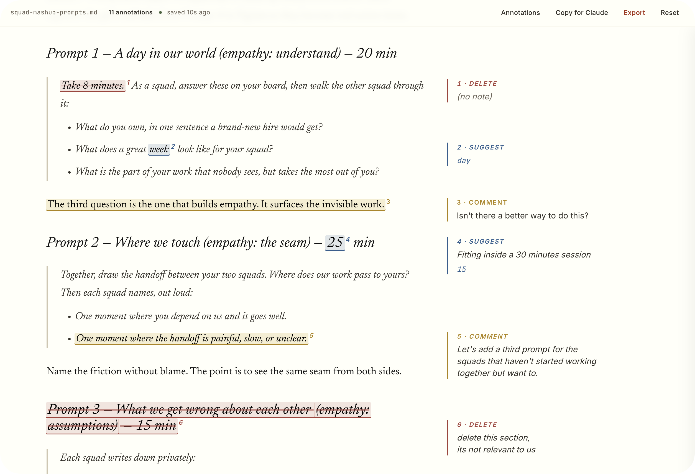

# annotate

**Suggest mode for your AI drafts.**

Turn a markdown file into a self-contained browser review surface: select text to leave Suggest / Comment / Delete annotations anchored as Tufte-style margin sidenotes, then export structured markdown for an AI to apply.



## The problem

**Reviewing long text with an AI shouldn't feel like dictating edits over the phone.**

You ask an AI for a draft. It writes a good one. Now you want to push back: tighten this sentence, cut that section, ask a question in the margin. So the copy-paste dance starts. Read in one window, type "in paragraph three, change X to Y" in another, lose your place, forget half of what you meant to flag.

**`annotate` makes the page itself the review surface.** You read and mark up in one place. The notes come back as structured markdown your AI can act on without you re-explaining a thing.

## What you get

- **Inline marks, margin notes.** Suggest an edit, leave a comment, or strike something out, all anchored to text position.
- **A clean handoff.** A tidy handoff doc for your AI to make the exact changes you want.
- **Zero infrastructure.** The output is one HTML file. Open it anywhere, no server.
- **Built to read in.** warm off-white paper, a book serif, and a quiet margin inspired by [Edward Tufte](https://edwardtufte.github.io/tufte-css/).

## Install

`annotate` is a standard `SKILL.md` skill, so it works in any agent.

**Paste this to your agent** and let it install itself:

```text
Install the annotate skill from https://github.com/jonnilundy/annotate-skill. Read the repo and set yourself up to use it the way that's native to your environment, then use it whenever I ask to review or annotate a markdown file.
```

**Or use the universal installer** (Claude Code, Cursor, Codex, and ~50 more agents):

```bash
npx skills add jonnilundy/annotate-skill
```

Works with `pnpx` too. It detects your agent and drops the skill where that agent looks for it.

**Or add it as a Claude Code plugin:**

```
/plugin marketplace add jonnilundy/annotate-skill
/plugin install annotate@annotate-skill
```

## Using it

Once it's installed, ask your agent to make a markdown file reviewable:

> "annotate `{file}.md`"
> "make this reviewable"
> "create an annotation page for this doc"

## The loop

1. The skill writes `{file}.review.html` next to your original md file and opens it.
2. **Select text** → choose between **Suggest · Comment · Delete**.
3. Each note appears as a margin **sidenote** tied to a numbered mark.
4. Add high-level direction in **Notes for Claude** at the top.
5. Click **Copy Changes** (or **Export** for a file) and give it back to your AI. 
6. Your AI applies the edits and answers the comments.

## Three kinds of marks

| Type | Meaning | Looks like |
|------|---------|-----------|
| **Suggest** | replace the selected text | blue underline with the new text |
| **Comment** | a note or a question | yellow-gold highlight |
| **Delete** | remove the selected text | red strike-through |

## Simple by design

The whole tool is one HTML file. No build and nothing to keep running. It honors your original markdown exactly: the review file is generated straight from your `.md`, and the export maps back to it line by line. And because the handoff is a compact list of just the changes, not the whole document, it stays token-efficient when you give it back to your AI.

Most review tools are loud. This one is quiet on purpose. The text sits in a narrow, readable column and your edits live in the margin beside it, the way notes have lived on paper for centuries. You can scan a whole document and see every mark in context without a panel covering the words you're reviewing. Borrowed, gratefully, from [Tufte CSS](https://edwardtufte.github.io/tufte-css/).

## Requirements

- Python 3 to generate the review file

## License

MIT licensed. See the [MIT License](https://opensource.org/license/mit).
